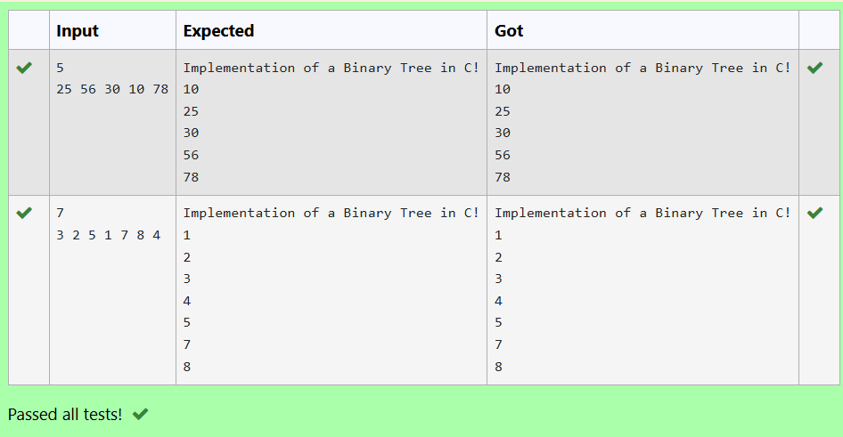

# Ex11 Tree Representation and Traversal
## DATE: 14/03/2025
## AIM:
To write a C function to perform post order traversal of a binary tree.

## Algorithm   
1. Start the Program.
2. Define a function display_postorder() that takes a pointer to the root node of the tree. 
3. Check if the current node (root_node) is not null. 
4. Recursively call display_postorder() for the left child of the current node. 
5. Recursively call display_postorder() for the right child of the current node. 
6. After visiting both children, print the value of the current node. 
7. End the Program.

## Program:
```c
/*
Program to perform post order traversal of a binary tree.

Developed by: Santhosh T
RegisterNumber: 212223220100
*/

/*struct node
{
int value;
struct node *left_child, *right_child;
};*/

struct node* insert_node(struct node* node, int value) // inserting nodes!
{
    if(node==NULL){
        return new_node(value);
    }
    if(value< node->value){
        node->left_child= insert_node(node->left_child,value);
    }
    else if(value> node->value){
        node->right_child=insert_node(node->right_child,value);
    }
    return node;
}

```

## Output:



## Result:
Thus, the function to perform post order traversal of a binary tree is implemented successfully.
